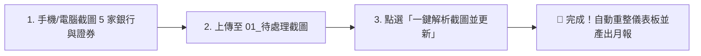

# 💼 個人全資產戰略管理中樞 (AI Asset Hub)

> **基於 Google Drive + Gemini 2.5 Flash + Google Sheets 的全自動月度資產盤點系統**  
> 告別繁瑣手動記帳，每月盤點只需將銀行與證券截圖丟進 Google Drive，點擊試算表「一鍵更新」，即刻完成資產結構重整、精算與 AI 財務診斷！

---

## 🌟 專案特色

1. **極致輕量・零維護**：
   - 100% 運行於 Google 原生雲端生態（Google Apps Script），**免自備伺服器、免租金、免電腦常開**。
2. **截圖智能解析（多模態 AI）**：
   - 串接 **Gemini 2.5 Flash API**，自動萃取各銀行現金、台股、美股複委託、定期定額豐存股等複雜截圖。
   - 使用 **Structured Outputs (JSON Schema)**，AI 負責 OCR 與語意辨識，程式端負責 100% 精準數學計算，杜絕計算幻覺。
3. **戰略資產配置雷達（Core-Satellite）**：
   - 自動將資產歸類為：**「核心大盤 ETF（50%~70%）」**、**「防禦性現金（20%~35%）」**、**「衛星個股與主題（15%~25%）」**。
   - 自動監控配置偏離度，提供再平衡建議。
4. **歷史淨值時間軸**：
   - 每次盤點自動追加一行歷史快照，自動沉澱每月的純流動總資產、投入成本與損益，繪製個人的「淨值成長曲線」。
5. **AI 財務軍師月報**：
   - 自動在分頁產出專屬的財務健康度體檢報告，包含攻守結構診斷與加碼建議。

---

## 📁 檔案結構

```
G:\Google Antigravity\myasset\
├── README.md                      # 本說明文件
├── gas/
│   ├── AllInOne_Code.js           # ⭐️【超推薦】全部模組整合為單一檔案，10秒極速複製貼上
│   ├── Code.gs                    # 主入口程式（選單註冊與月度盤點流程調度）
│   ├── GeminiService.gs           # Gemini 2.5 Flash API 多模態請求與 JSON Schema 定義
│   ├── SheetWriter.gs             # 5 大分頁排版、格式化、顏色標記與計算引擎
│   ├── Setup.gs                   # 試算表一鍵初始化與設定彈出視窗
│   ├── Config.gs                  # 系統參數與安全指令碼屬性管理
│   └── appsscript.json            # Apps Script 權限與台灣時區設定
```

---

## 🚀 5 分鐘快速安裝指南

### 第一步：建立 Google 試算表
1. 打開瀏覽器進入 [Google 雲端硬碟](https://drive.google.com/)。
2. 點選左上角「新增」➔ 建立一份新的 **「Google 試算表」**（檔名可自訂，例如：`我的全資產管理中樞`）。

### 第二步：貼入 Apps Script 程式碼
1. 在剛建立的 Google 試算表中，點選上方工具列的 **「擴充功能」➔「Apps Script」**。
2. 將編輯器內原本預設的程式碼清空。
3. 打開 `gas/AllInOne_Code.js`，**全部複製**（Ctrl + A ➔ Ctrl + C），直接貼入 Apps Script 編輯器中。
4. 點選編輯器上方的 💾 **「儲存專案」** 圖示（或按 `Ctrl + S`）。

### 第三步：取得免費 Gemini API Key
1. 前往 [Google AI Studio](https://aistudio.google.com/)。
2. 點選左上角 **「Get API key」** ➔ **「Create API key」**。
3. 複製產生的 API Key（開頭通常為 `AIzaSy...`）。
   > 💡 **提示**：Google AI Studio 免費層每天提供 1,500 次請求，每月盤點僅需 1 次，**終身完全免費**！

### 第四步：建立 Google Drive 截圖資料夾
1. 在你的 Google 雲端硬碟中，建立兩個資料夾：
   - `01_待處理截圖`（每個月丟截圖的地方）
   - `02_歷史截圖封存`（解析完畢後自動封存備份）
2. 分別點進這兩個資料夾，從瀏覽器網址列複製最後那串 **資料夾 ID**：
   * 例如網址：`https://drive.google.com/drive/folders/1a2B3c4D5e6F7g8H9i0J`
   * 其中的 `1a2B3c4D5e6F7g8H9i0J` 就是該資料夾的 ID。

### 第五步：初始化試算表與設定參數
1. 回到你的 Google 試算表分頁，**重新整理網頁（F5）**。
2. 重新整理後，上方功能表列最右側會出現自訂選單 **「🚀 資產管理」**。
3. 點選 **「🚀 資產管理」➔「🛠️ 初始化試算表結構與樣式」**：
   * 第一次執行時，Google 會彈出「需要授權」視窗：
     * 點擊「繼續」➔ 選擇你的 Google 帳號 ➔ 點擊「進階 (Advanced)」➔ 點擊「前往應用程式 (不安全)」➔ 點擊「允許」。
   * 授權後再次點選「🛠️ 初始化試算表結構與樣式」，系統會自動建立 **總覽儀表板、銀行明細、持倉明細、歷史記錄、AI 月報** 五大精美分頁！
4. 點選 **「🚀 資產管理」➔「⚙️ 設定系統參數」**：
   * 依序貼上你在步驟三與四取得的：
     1. **Gemini API Key**
     2. **「待處理截圖」資料夾 ID**
     3. **「歷史截圖封存」資料夾 ID**
   * 設定會安全儲存在試算表的「指令碼屬性」中，無須擔心外洩。

---

## 📅 每月盤點日常操作流程（只需 3 步驟）



1. **截圖**：每月底或季底，在各網銀 App、證券庫存 App 截圖（共約 5~10 張）。
2. **上傳**：用手機或電腦直接把截圖上傳到 Google Drive 的 `01_待處理截圖` 資料夾。
3. **一鍵盤點**：
   * 打開你的 Google 試算表，點選 **「🚀 資產管理」➔「📥 一鍵解析雲端硬碟截圖並更新」**。
   * 點擊確認後，等待約 15 秒。
   * 系統會自動辨識、計算、更新儀表板、在歷史記錄追加一行、產出 AI 財務月報，並自動將圖片搬移至封存資料夾備份！

---

## 📊 五大分頁功能說明

| 分頁名稱 | 核心內容與用途 |
| :--- | :--- |
| **總覽儀表板 (Dashboard)** | 頂部 KPI 卡片（純流動總資產、總投入成本、未實現獲利、總報酬率、現金水位）、三大戰略板塊健康度分析（核心大盤 ETF vs 防禦現金 vs 衛星個股）、台幣 vs 美元市場分佈。 |
| **銀行現金明細 (Cash)** | 各家銀行機構、原幣金額（TWD/USD）、參考匯率折算、佔現金總比重、主要功能備註。 |
| **證券持倉明細 (Holdings)** | 跨市場/跨帳戶明細（00692, 0050, 006208, VTI, TSLA 等），記錄持股數、成本、現值、損益、報酬率與紅綠漲跌配色。 |
| **歷史淨值記錄 (History)** | 每次盤點自動追加一筆快照，持續累積個人總淨值增長曲線。 |
| **AI 財務月報 (Monthly_Report)** | Gemini 針對本月資產組合生成的客製化體檢報告，包含核心衛星體質評估與加碼防禦建議。 |

---

## 💡 常見問題與小技巧

* **Q: 截圖中有帳號個資或敏感資訊安全嗎？**
  * 本專案直接由你的 Google Apps Script 發送至 Google 官方的 Gemini API，無任何第三方中介伺服器，資料 100% 掌握在你的 Google 帳號與 Google Drive 中。
* **Q: 如果某一檔股票沒有辨識到怎麼辦？**
  * 在「證券持倉明細」分頁中，所有欄位都是開放的 Google 試算表儲存格，你可以隨時手動增修微調。
* **Q: 核心 ETF 與衛星個股的判定規則可以自訂嗎？**
  * 可以！若未來新增了其他 ETF 或個股，只需在 `GeminiService.gs`（或 `AllInOne_Code.js` 的 `promptText`）中加入標的代號即可。
